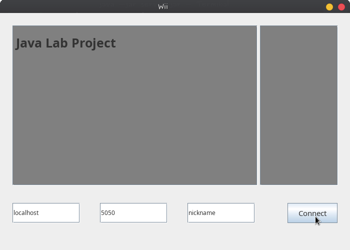
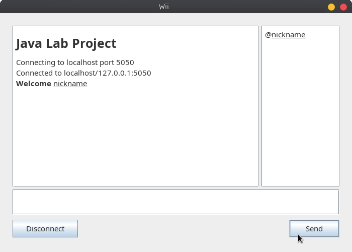
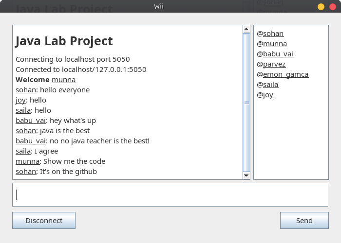
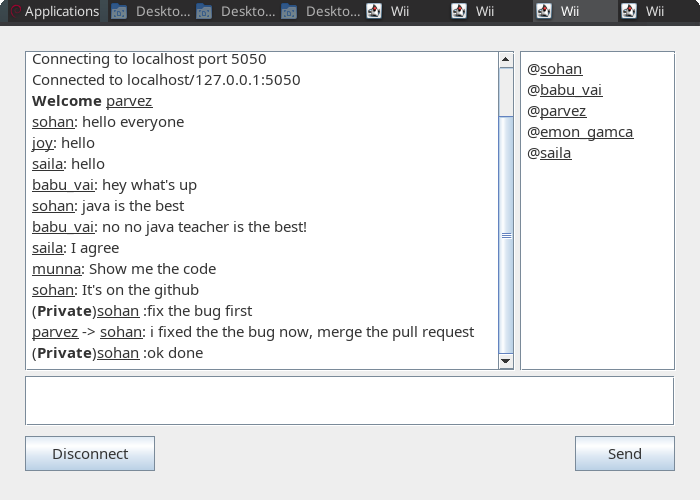
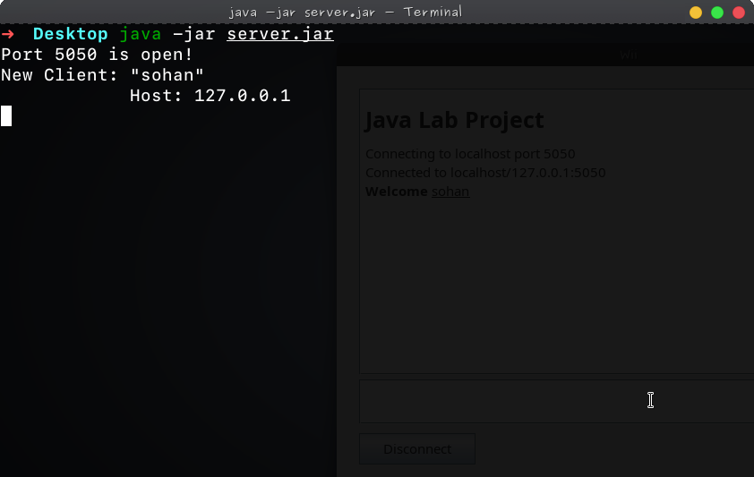

# Simple Chat Application

A basic chat application where multiple users can connect to a server and chat with each other over TCP connections.

## Overview

This project was developed as a java lab project. The application allows users to connect to a server using the server's IP address, port, and a chosen nickname. Once connected, users can engage in group chats or send private messages using the format `@name message`.

## Usage

1. Clone the repository:

    ```bash
    https://github.com/sohan-reza/CSE-332-Lab-Project.git
    ```
2. Open the project in IntelliJ IDEA.

3. Run the server application.

4. Run the client application and provide the server's IP ( localhost default ), port ( 5050 default ), and a chosen nickname to connect.

5. Start chatting with other connected users.

## Screenshots

### Client:




### Server:


## Acknowledgments

This project was built from scratch by referencing various resources and existing projects to understand the concepts and implementation details of a chat application. While I followed tutorials and studied existing projects for guidance, all the code in this repository was implemented independently.

I'm grateful for the knowledge and inspiration gained from all of the resources while coding this project from scratch.